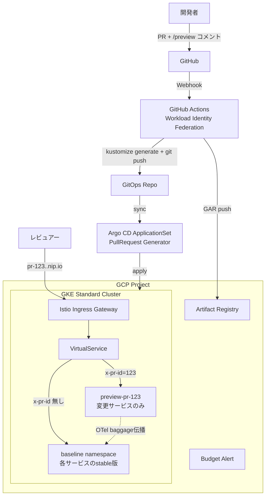

# GKE + Istio による PR プレビュー環境 設計書

> 個人学習用途・GCP・Terraform・最小構成からの段階拡張

-----

## 1. 概要

### 1.1 目的

GitHub Pull Request ごとに、変更されたマイクロサービスを baseline 環境に重ねてデプロイし、HTTP ヘッダー経由で PR 専用の通信経路を作るスイムレーン型のプレビュー環境を、GCP + GKE + Istio で構築する。学習目的であり、最小構成から段階的に機能を追加していく。

### 1.2 スコープ

- **対象環境**: GCP 上の GKE Standard クラスタ（個人プロジェクト）
- **対象 IaC**: Terraform（GCP リソースと Istio までを管理）
- **対象アプリ**: 学習用に新規作成する Go 製マイクロサービス（最終的に 2〜3 個）
- **対象 SCM/CI**: 個人 GitHub アカウント + GitHub Actions

### 1.3 確定した前提

|項目          |選択                          |理由                                   |
|------------|----------------------------|-------------------------------------|
|GKE モード     |Standard                    |OSS Istio 利用時の Autopilot コスト爆発を回避するため|
|Service Mesh|OSS Istio (自前 install)      |学習目的のため、マネージド版の抽象化を避ける               |
|ドメイン        |nip.io                      |独自ドメイン取得不要、Cloud DNS のセットアップも不要      |
|Terraform 範囲|C: GCP + Istio まで           |アプリは Argo CD などの別ツールで管理し責務分離         |
|予算管理        |Budget Alert を Terraform で作成|予算超過の早期検知                            |

-----

## 2. 全体アーキテクチャ

### 2.1 システム構成図



### 2.2 リクエストの流れ

1. レビュアーが `http://pr-123.<INGRESS-IP>.nip.io/` にアクセス
1. nip.io が `<INGRESS-IP>` を返し、Istio Ingress Gateway に到達
1. Gateway 側 VirtualService が Host ヘッダー `pr-123.*` を見て `x-pr-id: 123` ヘッダーを注入
1. メッシュ内の各サービスの VirtualService が `x-pr-id` を見て、PR 用 subset があればそちらに、無ければ baseline subset にルーティング
1. 各アプリは OpenTelemetry baggage で `x-pr-id` を下流に引き継ぐ
1. 結果として PR 用 Pod があるサービスは PR 版、それ以外は baseline 版を経由したレスポンスが返る

-----

## 3. フェーズ分け

学習目的のため、4 フェーズに分けて段階的に構築する。各フェーズで動くものができる状態を保つ。

|Phase      |目標                                |完了基準                                     |
|-----------|----------------------------------|-----------------------------------------|
|1. 最小構成    |GKE + Istio が動き、サンプル1個に外部からアクセスできる|`curl http://hello.<IP>.nip.io` が 200 を返す|
|2. GitOps 化|Argo CD で baseline をデプロイ管理        |git push → 自動 sync が成立                   |
|3. PR プレビュー|PR コメントで PR 用 Pod が立ち、ヘッダーで分岐する   |スイムレーンが動作する                              |
|4. 仕上げ     |TLS 化・可観測性・ドキュメント                 |HTTPS でアクセス可能、Kiali で可視化                 |

-----

## 4. Phase 1: 最小構成

### 4.1 ゴール

- Terraform で GCP プロジェクト周りと GKE Standard を作成
- Terraform から Istio を Helm でインストール
- サンプルアプリ 1 個（`hello`）を手動で kubectl apply
- `http://hello.<INGRESS-IP>.nip.io/` にアクセスできる
- Budget Alert が設定されている

### 4.2 GCP リソース構成

|リソース                               |用途          |備考                                                 |
|-----------------------------------|------------|---------------------------------------------------|
|GCP Project                        |全リソースの入れ物   |既存 or Terraform で新規作成                              |
|VPC + Subnet                       |GKE 用       |カスタム VPC を 1 個。Pod/Service に Secondary IP Range を確保|
|GKE Standard Cluster               |k8s         |リージョナル/ゾーナルは選択（4.4 参照）                             |
|Node Pool                          |ワーカーノード     |`e2-small` × 2 など最小構成（4.4 参照）                      |
|Artifact Registry                  |コンテナイメージ    |`<region>-docker.pkg.dev/<project>/preview`        |
|Service Account (Workload Identity)|GHA から GCP へ|Workload Identity Federation 利用                    |
|Budget Alert                       |コスト監視       |月額予算と通知メール                                         |

### 4.3 Terraform ディレクトリ構成

```
terraform/
├── envs/
│   └── dev/
│       ├── main.tf            # モジュール呼び出し
│       ├── variables.tf
│       ├── outputs.tf
│       ├── backend.tf         # GCS バックエンド
│       └── terraform.tfvars   # gitignore 対象
├── modules/
│   ├── project/               # API 有効化, IAM
│   ├── network/               # VPC, Subnet
│   ├── gke/                   # GKE クラスタ + ノードプール
│   ├── artifact_registry/
│   ├── workload_identity/     # GHA 連携用
│   ├── istio/                 # Helm provider で istio-base, istiod, gateway
│   └── budget/                # Budget Alert
└── README.md
```

### 4.4 主要な選択肢の整理

#### 4.4.1 リージョナル vs ゾーナルクラスタ

|観点   |リージョナル                                                        |ゾーナル                               |
|-----|--------------------------------------------------------------|-----------------------------------|
|メリット |コントロールプレーンが冗長で SLA 99.95% / ノードもマルチゾーン分散可能                    |コントロールプレーンが 1 ゾーンのみで安価、最小ノード数の制約も緩い|
|デメリット|コントロールプレーン無料枠 ($74.40/月相当) を超えるリスクは個人だと低いが、ノードがゾーン × 台数で増えると割高|SLA 99.5% でメンテ中はクラスタ操作不可、本番には不向き   |

→ **採用: ゾーナルクラスタ**。学習目的のため可用性は不要、コスト最小化を優先。

#### 4.4.2 ノードマシンタイプ

|候補             |スペック             |メリット                          |デメリット                      |
|---------------|-----------------|------------------------------|---------------------------|
|`e2-small`     |2 vCPU(共有) / 2 GB|最安、Istio + Hello World レベルなら動く|Istio sidecar + 数サービスでメモリ逼迫|
|`e2-medium`    |2 vCPU(共有) / 4 GB|余裕あり、Phase 3 まで耐える            |やや割高                       |
|`e2-standard-2`|2 vCPU(専有) / 8 GB|パフォーマンス安定                     |学習用途には過剰                   |

→ **採用: `e2-medium` × 2 ノード**。Phase 3 でマイクロサービス複数 + サイドカーが乗ることを考えると `e2-small` だと厳しい。

#### 4.4.3 Istio のインストール方法

|候補                                  |メリット                |デメリット                                          |
|------------------------------------|--------------------|-----------------------------------------------|
|`istioctl install`                  |公式推奨、設定検証が手厚い       |Terraform 管理外になりがち                             |
|Helm chart (Terraform helm provider)|Terraform で一気通貫管理できる|チャート構成（`base`/`istiod`/`gateway` の3つに分割）を理解する必要|
|Istio Operator                      |宣言的に管理可能            |Operator 自体が deprecated 方向、非推奨                 |

→ **採用: Helm chart 経由 (Terraform helm provider)**。範囲C（Istio までを Terraform 管理）に合致するため。`base` → `istiod` → `gateway` の3チャートを依存順に適用。

#### 4.4.4 Istio profile

|profile  |含まれるもの                      |備考                      |
|---------|----------------------------|------------------------|
|`default`|istiod, ingress gateway     |本番想定の標準構成               |
|`minimal`|istiod のみ                   |gateway なし、メッシュ内部だけで使う場合|
|`demo`   |上記 + egress gateway + 高ログレベル|検証用、リソース食う              |

→ **採用: `default` 相当を Helm の base + istiod + gateway の組み合わせで構成**。学習用途には demo は重く、minimal だと外部公開できない。

#### 4.4.5 Sidecar mode vs Ambient mode

|モード    |メリット               |デメリット               |
|-------|-------------------|--------------------|
|Sidecar|ドキュメント・教材が豊富、機能が安定 |Pod ごとにサイドカー分のリソース必要|
|Ambient|サイドカー不要で軽量、Pod 改変なし|比較的新しく機能差あり、教材が少ない  |

→ **採用: Sidecar mode**。学習目的には情報量が多い方が望ましい。Phase 4 以降で Ambient を試すのは可。

### 4.5 Phase 1 の Terraform 抜粋

```hcl
# envs/dev/main.tf
module "project" {
  source     = "../../modules/project"
  project_id = var.project_id
  apis = [
    "container.googleapis.com",
    "artifactregistry.googleapis.com",
    "iamcredentials.googleapis.com",
    "billingbudgets.googleapis.com",
  ]
}

module "network" {
  source     = "../../modules/network"
  project_id = var.project_id
  region     = var.region
}

module "gke" {
  source       = "../../modules/gke"
  project_id   = var.project_id
  zone         = var.zone
  network      = module.network.network_id
  subnetwork   = module.network.subnet_id
  machine_type = "e2-medium"
  node_count   = 2
}

module "istio" {
  source       = "../../modules/istio"
  cluster_name = module.gke.cluster_name
  depends_on   = [module.gke]
}

module "budget" {
  source           = "../../modules/budget"
  billing_account  = var.billing_account
  monthly_amount   = 50  # USD
  notify_emails    = var.notify_emails
}
```

```hcl
# modules/istio/main.tf
resource "helm_release" "istio_base" {
  name             = "istio-base"
  repository       = "https://istio-release.storage.googleapis.com/charts"
  chart            = "base"
  namespace        = "istio-system"
  create_namespace = true
  version          = var.istio_version
}

resource "helm_release" "istiod" {
  name       = "istiod"
  repository = "https://istio-release.storage.googleapis.com/charts"
  chart      = "istiod"
  namespace  = "istio-system"
  version    = var.istio_version
  depends_on = [helm_release.istio_base]
}

resource "helm_release" "istio_gateway" {
  name       = "istio-ingressgateway"
  repository = "https://istio-release.storage.googleapis.com/charts"
  chart      = "gateway"
  namespace  = "istio-ingress"
  create_namespace = true
  version    = var.istio_version
  depends_on = [helm_release.istiod]
}
```

### 4.6 Phase 1 の検証手順

1. `terraform apply` で GCP リソース + Istio をデプロイ
1. `gcloud container clusters get-credentials` で kubeconfig 取得
1. `kubectl get pods -n istio-system` で istiod が Running 確認
1. Ingress Gateway の External IP を取得: `kubectl -n istio-ingress get svc istio-ingressgateway`
1. サンプル `hello` Deployment + Service + Gateway + VirtualService を `kubectl apply`
1. `curl -H "Host: hello.<IP>.nip.io" http://<IP>/` で 200 が返る
1. 上記が動いたら Phase 2 へ

-----

## 5. Phase 2: GitOps 化

### 5.1 ゴール

- Argo CD を GKE 上にインストール（Helm 経由・Terraform 範囲外、kubectl で可）
- `baseline` namespace の各サービスを Git 管理に
- 個人 GitHub に GitOps リポジトリを作成
- main ブランチへの push で自動 sync

### 5.2 リポジトリ構成案

#### 案A: 1 リポジトリ（モノレポ）

```
preview-platform/
├── apps/
│   ├── hello/
│   └── echo/
├── gitops/
│   ├── base/
│   ├── overlays/
│   │   └── baseline/
│   └── argocd/
└── terraform/
```

- メリット：変更追跡が容易、PR で関連変更が一望できる
- デメリット：Argo CD が同じリポジトリの自分自身を sync する循環で混乱しやすい

#### 案B: 2 リポジトリ分離（アプリ用 / GitOps 用）

- メリット：責務が明確、CI のトリガーが整理しやすい、公式の Argo CD ベストプラクティス
- デメリット：個人作業ではリポジトリ往復が手間

→ **採用: 案A モノレポ**。個人プロジェクトで往復コストの方が痛い。Argo CD は `gitops/` 配下のみを監視するように Path 制限する。

### 5.3 Argo CD のインストール選択肢

|候補                          |メリット     |デメリット                          |
|----------------------------|---------|-------------------------------|
|Helm chart で kubectl install|シンプル、すぐ動く|Terraform 管理外                  |
|Terraform helm provider で管理 |一気通貫     |範囲C（Istio までが Terraform）の方針と外れる|
|Argo CD Operator            |宣言的に管理   |オーバーキル                         |

→ **採用: kubectl + Helm で手動インストール（範囲C 維持）**。Phase 1 で Istio を Terraform 化したのは「メッシュは土台」という整理。Argo CD は「アプリレイヤを動かすツール」なのでアプリ側に寄せる。

### 5.4 GitHub Actions の認証

#### 選択肢

|方式                          |メリット      |デメリット                                |
|----------------------------|----------|-------------------------------------|
|Service Account JSON キー     |古典的、設定が単純 |鍵の管理リスク、ローテーション必要、GitHub Secrets 漏洩懸念|
|Workload Identity Federation|鍵レス、短命トークン|初期設定が複雑                              |

→ **採用: Workload Identity Federation**。学習価値も高く、鍵管理を避けられる。

-----

## 6. Phase 3: PR プレビュー（本題）

### 6.1 ゴール

- 個人 GitHub の対象リポジトリに PR を立てると自動でビルド & デプロイ
- PR コメント `/preview` でプレビュー環境作成（明示トリガー方式）
- レビュアーは `http://pr-<番号>.<INGRESS-IP>.nip.io/` でアクセス可能
- マイクロサービス間通信もヘッダーでスイムレーン分離
- PR クローズで自動クリーンアップ

### 6.2 アプリ構成（学習用サンプル）

最低 2 サービス必要（スイムレーンが意味を持つには）。

```
[ Ingress ] → frontend → backend
```

実装言語は Go（普段触っているスタックに合わせる）。`frontend` は HTTP を受けて `backend` を呼ぶだけのシンプル構成。

### 6.3 PR 識別ヘッダーの設計

|項目           |内容                                                                               |
|-------------|---------------------------------------------------------------------------------|
|ヘッダー名        |`x-pr-id`                                                                        |
|値            |PR 番号（数値文字列）                                                                     |
|注入箇所         |Ingress Gateway の VirtualService が Host ヘッダー `pr-<N>.*` から PR 番号を抽出してリクエストヘッダーに付与|
|伝播           |OpenTelemetry baggage で全サービスを通過。アプリは otelhttp で計装                                |
|Istio 側ルーティング|サービスごとの VirtualService が `x-pr-id` を見て subset を分岐                                |

#### 6.3.1 ヘッダー命名の選択肢

|候補                |メリット                       |デメリット                           |
|------------------|---------------------------|--------------------------------|
|`x-pr-id`         |直感的、自前運用なので自由に決められる        |業界標準ではない                        |
|`baggage: pr-id=N`|W3C Baggage 標準、OTel との相性が良い|Istio 側で baggage の中身をパースするのに手間  |
|`x-routing-key`   |Signadot 流の汎用名             |PR 以外用途を想定するなら良いが今回はオーバーエンジニアリング|

→ **採用: `x-pr-id` を主、内部的には baggage にも入れて OTel 伝播に乗せる**。Istio の match は `x-pr-id` ヘッダーを直接見れば良い。アプリ側は OTel SDK が baggage で自動伝播し、HTTP クライアントが `x-pr-id` ヘッダーも合わせて付与するように共通ライブラリを書く。

### 6.4 PR ごとのリソース生成

#### 選択肢

|案                                           |メリット                     |デメリット                            |
|--------------------------------------------|-------------------------|---------------------------------|
|Argo CD ApplicationSet PullRequest Generator|Argo CD ネイティブ、PR 一覧から自動生成|テンプレート構造の学習コストあり                 |
|GitHub Actions が直接 kubectl apply            |明示的、デバッグしやすい             |GitOps の利点を活かせない、kubeconfig 管理が必要|
|GitHub Actions が GitOps リポジトリへ commit       |Actions と Argo CD を分離できる |リポジトリにノイズ commit が大量に積まれる        |

→ **採用: Argo CD ApplicationSet PullRequest Generator**。GitOps の旨味を学べる、Argo CD 公式機能で枯れている。

#### 6.4.1 ApplicationSet 例（イメージ）

```yaml
apiVersion: argoproj.io/v1alpha1
kind: ApplicationSet
metadata:
  name: pr-preview
  namespace: argocd
spec:
  generators:
    - pullRequest:
        github:
          owner: <your-github-username>
          repo: <repo-name>
          tokenRef:
            secretName: github-token
            key: token
          labels:
            - preview     # この label が付いた PR のみ対象
        requeueAfterSeconds: 60
  template:
    metadata:
      name: 'pr-{{number}}'
    spec:
      source:
        repoURL: https://github.com/<owner>/<repo>.git
        targetRevision: '{{head_sha}}'
        path: gitops/overlays/_template
        kustomize:
          namePrefix: 'pr-{{number}}-'
          commonLabels:
            preview.example.com/pr-id: '{{number}}'
      destination:
        server: https://kubernetes.default.svc
        namespace: 'preview-pr-{{number}}'
      syncPolicy:
        automated:
          prune: true
          selfHeal: true
        syncOptions:
          - CreateNamespace=true
```

PR に `preview` ラベルが付いている間だけ環境が立つ。ラベル削除 or PR クローズで `prune` により自動削除。

### 6.5 Istio リソース設計

#### 6.5.1 baseline の DestinationRule

```yaml
apiVersion: networking.istio.io/v1beta1
kind: DestinationRule
metadata:
  name: backend
  namespace: baseline
spec:
  host: backend.baseline.svc.cluster.local
  subsets:
    - name: baseline
      labels:
        app: backend
        version: baseline
```

#### 6.5.2 PR が立つたびに動的に追加される subset

PR 用 Pod は `version: pr-<N>` ラベルを持つ。subset を毎回追加する代わりに、**Pod ラベルを subset 名に動的にマッピングする `WorkloadSelector` 戦略**を取る。

具体的には、PR ごとに DestinationRule を新規作成するのではなく、**サービスごとの VirtualService の `match` を ApplicationSet が動的に書き換える**方式を採用する。

代替案：

- 案A: PR ごとに DestinationRule + VirtualService を別ファイルとして生成
  - メリット: 影響範囲が PR 内に閉じる、削除も簡単
  - デメリット: VirtualService が同一 host に複数あると Istio がマージ動作するため、優先順位の制御が必要
- 案B: baseline 側の VirtualService を ConfigMap 化し、PR 数に応じて再生成
  - メリット: 単一の VirtualService で完結
  - デメリット: baseline VS が PR の状態に依存して書き換わるのが直感に反する

→ **採用: 案A（PR ごとに独立した DestinationRule + VirtualService）**。`exportTo` を PR namespace に絞ることで影響範囲を閉じる。VirtualService の優先度は match の順序で制御。

### 6.6 OpenTelemetry baggage によるコンテキスト伝播

Go の場合の最小構成：

```go
import (
    "go.opentelemetry.io/contrib/instrumentation/net/http/otelhttp"
    "go.opentelemetry.io/otel"
    "go.opentelemetry.io/otel/propagation"
)

func init() {
    otel.SetTextMapPropagator(propagation.NewCompositeTextMapPropagator(
        propagation.TraceContext{},
        propagation.Baggage{},
    ))
}

// 受信: 標準ライブラリの net/http に otelhttp.NewHandler を被せる
http.Handle("/", otelhttp.NewHandler(myHandler, "frontend"))

// 送信: http.Client の Transport に otelhttp.NewTransport を被せる
client := &http.Client{
    Transport: otelhttp.NewTransport(http.DefaultTransport),
}
```

ただしこのままだと baggage は伝播するが、Istio が見るのは `x-pr-id` ヘッダー直接。**入口 Gateway で `x-pr-id` を baggage と両方に展開し、各サービスでも `x-pr-id` を素のヘッダーとしてコピーする小さなミドルウェア**を共通ライブラリ化するのが現実解。

```go
// 受信時: x-pr-id をリクエストコンテキストに保存
// 送信時: コンテキストから x-pr-id を取り出してヘッダーに付ける
```

### 6.7 ハマりポイント早見表

|項目            |起きる症状                                  |対策                                                                  |
|--------------|---------------------------------------|--------------------------------------------------------------------|
|ヘッダー伝播漏れ      |1 ホップ目は PR 版に行くが 2 ホップ目から baseline に逃げる|OTel の Composite propagator + 共通 HTTP middleware で `x-pr-id` を必ず引き回す|
|baseline DB 汚染|PR の書き込みが baseline DB を汚す              |Phase 3 では読み取り中心の検証に絞る、書き込み系は Phase 4 で別 DB / トランザクション分離を検討         |
|非同期メッセージ      |Kafka 等経由の通信はメッシュの外                    |Phase 3 のスコープ外。やるなら selective consumption を実装                       |
|Sidecar 起動順序  |アプリより先に istio-proxy が落ちると 502          |`holdApplicationUntilProxyStarts: true` を Pod annotation で指定        |
|nip.io が解決できない|DNS over HTTPS 等の特殊環境                  |`/etc/hosts` 直接書き換えで回避                                              |

-----

## 7. Phase 4: 仕上げ

### 7.1 TLS 化

#### 選択肢

|案                                   |メリット                    |デメリット                 |
|------------------------------------|------------------------|----------------------|
|cert-manager + Let’s Encrypt HTTP-01|nip.io でも HTTP-01 は通る、無料|PR ごとに証明書発行が走る、レート制限注意|
|自己署名証明書                             |設定が単純、レート制限なし           |ブラウザ警告が出る             |
|TLS なしで Phase 終了                    |何もしない                   |学習途中なら可               |

→ **推奨: cert-manager + Let’s Encrypt HTTP-01**（PR 数が多くなければ問題なし）。

### 7.2 可観測性

|ツール                   |用途                |コスト        |
|----------------------|------------------|-----------|
|Kiali                 |Istio のサービストポロジ可視化|無料、Pod 1 個分|
|Prometheus + Grafana  |メトリクス             |無料、Pod 数個分 |
|Jaeger / Tempo        |分散トレース            |無料、ストレージ要  |
|Cloud Operations Suite|GCP マネージド         |課金あり       |

→ **採用: Kiali + Prometheus（学習目的の最小構成）**。トレースは余裕があれば Jaeger を追加。

-----

## 8. 全体ディレクトリ構成（最終形）

```
preview-platform/                      # GitHub の単一リポジトリ
├── README.md
├── docs/
│   └── design.md                      # 本ドキュメント
├── apps/                              # マイクロサービスのソース
│   ├── frontend/
│   │   ├── main.go
│   │   ├── Dockerfile
│   │   └── internal/middleware/       # x-pr-id 伝播の共通ロジック
│   └── backend/
│       ├── main.go
│       └── Dockerfile
├── gitops/
│   ├── base/                          # サービスごとの kustomize base
│   │   ├── frontend/
│   │   └── backend/
│   ├── overlays/
│   │   ├── baseline/                  # baseline namespace 用
│   │   └── _template/                 # PR overlay の雛形（ApplicationSet が namePrefix で派生）
│   ├── istio/                         # baseline の Gateway / VS / DR
│   └── argocd/
│       ├── install/                   # Argo CD 自体のマニフェスト
│       └── applicationsets/
│           ├── baseline.yaml
│           └── pr-preview.yaml
├── terraform/
│   ├── envs/dev/
│   └── modules/
│       ├── project/
│       ├── network/
│       ├── gke/
│       ├── artifact_registry/
│       ├── workload_identity/
│       ├── istio/
│       └── budget/
└── .github/
    └── workflows/
        ├── build-and-push.yml         # PR push でイメージビルド & GAR push
        └── pr-label.yml               # /preview コメントで preview ラベルを付与
```

-----

## 9. コスト見積もり（最小構成）

> 概算。リージョンや為替で変動。Tokyo (asia-northeast1) 想定。

|項目                           |月額目安 (USD)|備考                                              |
|-----------------------------|----------|------------------------------------------------|
|GKE ゾーナルクラスタ管理料              |0         |Standard ゾーナルは無料枠あり、ただし zonal でも管理料が発生する場合あり、要確認|
|`e2-medium` × 2 ノード          |~50       |24h 稼働の場合                                       |
|External LB (Ingress Gateway)|~18       |Forwarding rule + 転送量                           |
|Artifact Registry            |~1        |ストレージ少量                                         |
|Egress                       |数 USD     |学習用途なら無視できる                                     |
|**合計**                       |**~70**   |24h 稼働前提                                        |

**コスト圧縮テクニック**:

- 使わない時は `terraform destroy` で全消し（再構築は 10 分程度）
- GKE クラスタを止めるだけでも管理料以外は削減できる
- ノードを `e2-small` × 1 に絞れば半額以下、ただし Phase 3 では厳しい

→ **Budget Alert は 50 USD で警告、80 USD で強通知** を Terraform で設定する想定。

-----

## 10. リスクと対策まとめ

|リスク                               |影響                              |対策                                                   |
|----------------------------------|--------------------------------|-----------------------------------------------------|
|クラスタを消し忘れて課金が膨らむ                  |月数百ドル超え                         |Budget Alert + 利用後の destroy 習慣化                      |
|Istio のバージョンと GKE バージョンの相性        |apply 失敗                        |Istio 公式の Supported Releases を Terraform variable で固定|
|Workload Identity Federation の設定ミス|GHA から GAR push できない            |Phase 1 完了時点で疎通テストを書いておく                             |
|個人 GitHub の API レート制限             |Argo CD PR Generator が PR を取りこぼす|requeueAfterSeconds を緩める、PAT で認証                     |
|nip.io がブロックされる環境                 |検証不能                            |/etc/hosts に直接書く / 独自ドメイン取得に切替                       |

-----

## 11. 学習の流れ（Claude Code への指示順）

Claude Code に作業を依頼する際の推奨順序。各ステップでコミット & 動作確認すること。

1. **Phase 1-A**: Terraform で GCP プロジェクト周りと VPC, GKE, Artifact Registry, Workload Identity, Budget を作る
1. **Phase 1-B**: Terraform helm provider で Istio を入れる
1. **Phase 1-C**: 手動 kubectl で hello サンプル（istio-injection 有効 namespace + Deployment + Service + Gateway + VirtualService）を入れて nip.io でアクセスできるか確認
1. **Phase 2-A**: Argo CD を Helm で kubectl install
1. **Phase 2-B**: hello サンプルを GitOps 管理に移し、git push → 自動 sync を確認
1. **Phase 2-C**: GitHub Actions で WIF 経由で Artifact Registry に push できるか確認
1. **Phase 3-A**: frontend / backend の 2 サービスを Go で実装、ローカルで動作確認
1. **Phase 3-B**: baseline 用の kustomize overlay を作って Argo CD で sync
1. **Phase 3-C**: x-pr-id 伝播ミドルウェアを実装、サービス間で確認
1. **Phase 3-D**: PR 用 overlay の _template を作る
1. **Phase 3-E**: ApplicationSet PullRequest Generator を仕込む
1. **Phase 3-F**: Ingress Gateway の VirtualService で Host から x-pr-id を注入
1. **Phase 3-G**: PR を立てて E2E 動作確認
1. **Phase 4-A**: cert-manager で TLS 化
1. **Phase 4-B**: Kiali + Prometheus 導入
1. **Phase 4-C**: README 整備

-----

## 12. 参考資料（公式優先）

- Istio 公式: https://istio.io/latest/docs/
- GKE Standard 公式: https://cloud.google.com/kubernetes-engine/docs
- Argo CD ApplicationSet PR Generator: https://argo-cd.readthedocs.io/en/stable/operator-manual/applicationset/Generators-Pull-Request/
- Terraform GCP provider: https://registry.terraform.io/providers/hashicorp/google/latest/docs
- Terraform Helm provider: https://registry.terraform.io/providers/hashicorp/helm/latest/docs
- Workload Identity Federation: https://cloud.google.com/iam/docs/workload-identity-federation
- nip.io: https://nip.io/
- OpenTelemetry Go: https://opentelemetry.io/docs/languages/go/

-----

## 付録 A: 用語

|用語      |意味                                             |
|--------|-----------------------------------------------|
|baseline|常駐している main ブランチ相当の安定環境                        |
|スイムレーン  |baseline の上に PR ごとの細い経路を引く方式                   |
|DSR     |Dynamic Service Routing。Mercari がスイムレーン方式に付けた呼称|
|subset  |Istio DestinationRule で定義する論理的な Pod グループ       |
|baggage |OpenTelemetry の context propagation 機構の一つ      |
|WIF     |Workload Identity Federation。GCP の鍵レス認証        |
